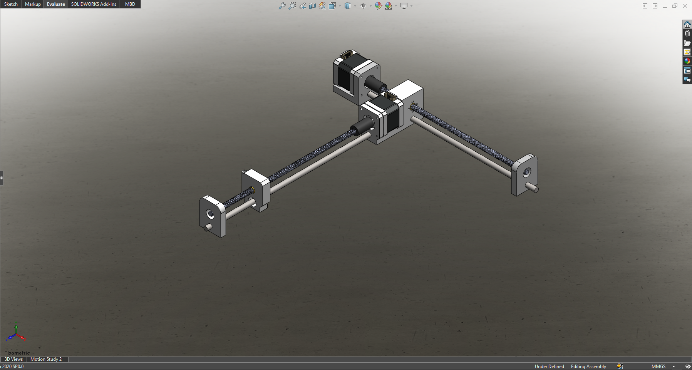
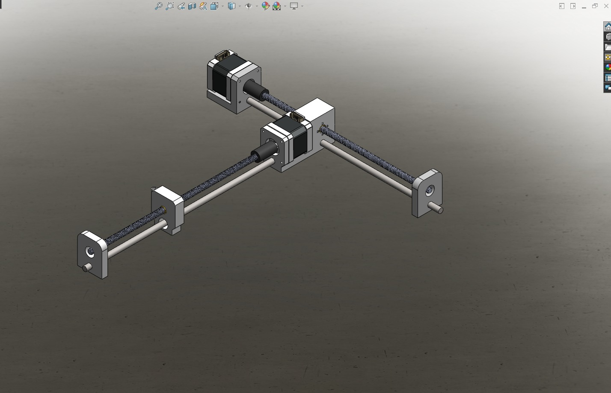
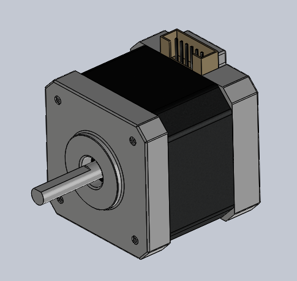
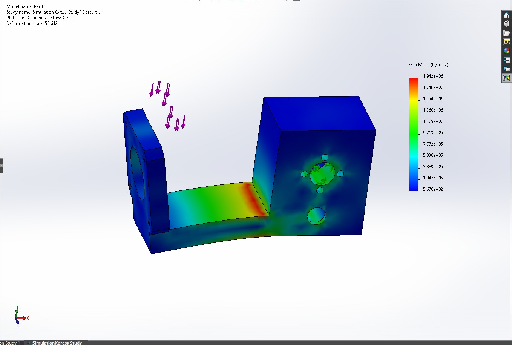
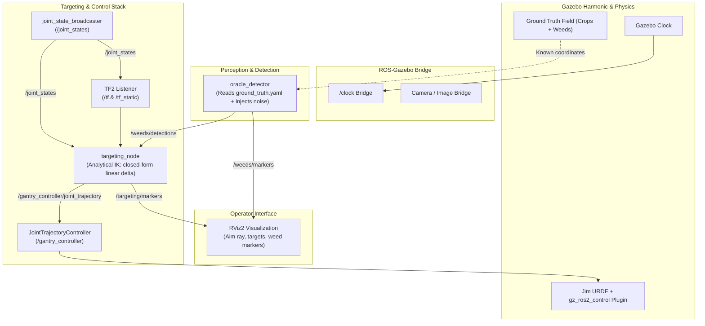

# Jim — Precision 2-DOF Laser Weeding Gantry

<div align="center">


**Sub-millimeter autonomous laser weeding gantry system built on ROS 2 Jazzy, Gazebo Harmonic, and `ros2_control`.**

</div>

---

<div align="center">
  
  <p><em>Figure 1: Full 3D CAD mechanical assembly of the Jim 2-DOF Cartesian laser weeding gantry.</em></p>
</div>

---

## 📖 Table of Contents

- [Executive Summary](#-executive-summary)
- [Mechanical & CAD Architecture](#-mechanical--cad-architecture)
  - [3D CAD Models & Assemblies](#3d-cad-models--assemblies)
  - [Finite Element Analysis (FEA)](#finite-element-analysis-fea)
  - [Kinematics & Hard Engineering Specs](#kinematics--hard-engineering-specs)
- [Software & Control Architecture](#-software--control-architecture)
  - [High-Level Dataflow](#high-level-dataflow)
  - [Coordinate Frames & TF Tree](#coordinate-frames--tf-tree)
  - [Defensible Engineering Decisions](#defensible-engineering-decisions)
- [ROS 2 Packages Breakdown](#-ros-2-packages-breakdown)
- [Quickstart Guide](#-quickstart-guide)
  - [Prerequisites](#prerequisites)
  - [One-Command Launch (Docker)](#one-command-launch-docker)
  - [Manual Docker Workflow](#manual-docker-workflow)
- [Targeting & Perception Pipeline](#-targeting--perception-pipeline)
  - [Field Generation](#field-generation)
  - [Oracle Weed Detector](#oracle-weed-detector)
  - [Analytical TF Targeting](#analytical-tf-targeting)
- [Hardware Implementation Roadmap](#-hardware-implementation-roadmap)
- [License & Acknowledgments](#-license--acknowledgments)

---

## 🌿 Executive Summary

**Jim** is an autonomous agricultural robot designed for targeted non-chemical weed eradication. Unlike bulky field robots or complex multi-axis articulated arms, Jim utilizes a static **2-DOF Cartesian gantry** suspended 300 mm above a 250 mm × 250 mm agricultural plot.

A downward-facing perception stack identifies weeds in real time, and the dual-axis gantry positions a focused optical laser beam with sub-millimeter precision over each weed meristem to eliminate it without disturbing adjacent crop root systems or compacting soil.

### Core Highlights
* **Zero Overhead IK**: Pure linear TF-based closed-form targeting in 4 lines of Python — no heavy OMPL or sampling configuration space required.
* **Deterministic Motion Control**: Driven via standard `ros2_control` and `JointTrajectoryController`.
* **Photorealistic Harmonic Simulation**: Complete field simulation in Gazebo Harmonic with dynamic procedural crop and weed distribution.
* **Oracle Perception with Synthetic Noise**: Fully decoupled perception testing with configurable runtime noise, miss rates, and false positives.
* **Containerized Environment**: Complete ROS 2 Jazzy + Gazebo Harmonic + GUI pass-through in Docker.

---

## ⚙️ Mechanical & CAD Architecture

The physical gantry is designed from the ground up for rigid, repeatable linear motion, thermal reliability, and rapid additive manufacturing.

<div align="center">
  <table>
    <tr>
      <td align="center" width="50%">
        
        <br />
        <b>Dual-Axis Cross Gantry Assembly</b>
      </td>
      <td align="center" width="50%">
        
        <br />
        <b>NEMA 17 Stepper Actuator Model</b>
      </td>
    </tr>
  </table>
</div>

### 3D CAD Models & Assemblies

All CAD source files are housed under [`Main_Model/`](Main_Model/):
* **Master Assemblies**: `Main.SLDASM`, `jim_description.SLDASM` (configured for URDF/STL export).
* **2D Technical Drawings**: `D1_Main.SLDDRW` with detailed machining tolerances and hole patterns.
* **Drive Components**: T8 lead screws (`lead_screw.SLDPRT`), brass anti-backlash trapezoidal nuts (`nut.SLDPRT`), 8 mm hardened linear guide rods (`Rod.SLDPRT`), and flexible jaw couplers (`Coupler.SLDPRT`).
* **Custom Structural Brackets**: 3D printable brackets (`mount_bracket.STL`, `holding_bracket.STL`, `holding_bracket_y.STL`, `Part6.STL`, `Lazer block^X-axis.STL`).
* **Interchange Formats**: Standard `STEP` format (`Nima 17 40x42x5mm.STEP`) and motion study animation (`assets/cad_motion_study_xaxis.mp4`).

### Finite Element Analysis (FEA)

Structural rigidity is critical: any deflection in the motor bracket under rapid acceleration would translate into beam aiming error at the soil plane.

<div align="center">
  
  <p><em>Figure 2: Finite Element Analysis (FEA) of motor mounting bracket (Part6) in SolidWorks SimulationXpress.</em></p>
</div>

* **Study**: Static nodal stress simulation (von Mises criterion).
* **Max von Mises Stress**: \(1.942 \times 10^6\text{ N/m}^2\) (\(\approx 1.94\text{ MPa}\)).
* **Structural Safety Margin**: Compared against the yield strength of structural PETG/PLA (\(> 45\text{ MPa}\)), the safety factor exceeds **20×**, ensuring zero structural deflection during gantry maneuvers.

### Kinematics & Hard Engineering Specs

| Parameter | Specification | Rationale & Engineering Formula |
| :--- | :--- | :--- |
| **Working Envelope** | \(250\text{ mm} \times 250\text{ mm}\) | Covers standard vegetable/nursery plot grid |
| **Z Height (Beam Clearance)** | \(300\text{ mm}\) above soil | Keeps optics clear of crop canopy and debris |
| **Lead Screws** | T8 (2 mm pitch, 4 starts) | **8 mm lead / revolution** for optimal speed-to-torque balance |
| **Guide Rails** | 8 mm precision hardened steel | Smooth rod with linear sleeve bearings |
| **Full Step Resolution** | **0.04 mm / full step** | \(8\text{ mm / rev} \div 200\text{ steps / rev} = 0.04\text{ mm}\) |
| **16× Microstepping Resolution** | **0.0025 mm / microstep** | \(8\text{ mm / rev} \div 3200\text{ steps / rev} = 2.5\ \mu\text{m}\) |
| **Maximum Safe Velocity** | **0.035 m/s** (\(35\text{ mm/s}\)) | **Lead screw critical whirling speed limit**: \(4.76 \times 10^6 \times 6.2 / 300^2 \approx 328\text{ RPM}\) (80% derated) |
| **Actuators** | NEMA 17 Stepper (1.8° step angle) | Standard form factor with high holding torque |
| **Operating Current** | **0.8 A – 1.0 A** *(NOT 1.5 A)* | 1.5 A drives casing to \(\sim 88^\circ\text{C}\); PLA glass transition \(T_g = 60^\circ\text{C}\) |
| **Torque Margin** | \(\approx 13\text{ mN}\cdot\text{m}\) vs \(400\text{ mN}\cdot\text{m}\) | **\(> 12\times\) holding margin**, preventing skipped steps |
| **Stepper Drivers** | MKS TMC2209 | SilentStepStick with StallGuard sensorless homing |

---

## 🧠 Software & Control Architecture

### High-Level Dataflow



### Coordinate Frames & TF Tree

The system is strictly [REP-103](https://www.ros.org/reps/rep-0103.html) compliant (metres, radians, SI units). Exactly **one** unit conversion exists in the entire stack (inside the hardware interface).

```
world
└── base_link                    (300 mm above soil plane)
    ├── x_carriage               (prismatic joint_x, 180° roll from CAD export)
    │   └── y_carriage           (prismatic joint_y)
    │       └── laser_aim_link   (Z-axis IS the optical beam direction)
    └── work_surface             (Soil plane, origin at center of reachable plot)
                                 Static TF: (0.1837, -0.2516, -0.3000) from base_link
```

> [!NOTE]
> **CAD 180° Roll Convention**: `joint_x` carries a 180° roll offset from the CAD export, causing machine \(+Y\) to translate along world \(-Y\). Consequently, `targeting_node.solve()` negates `joint_y`. This is a deliberate, defensible kinematic convention, not a bug.

### Defensible Engineering Decisions

1. **NO Nav2**: Jim is a static Cartesian gantry. There is no mobile differential base, no wheel odometry, and no navigation costmap. Omitting Nav2 eliminates unnecessary computational overhead.
2. **NO MoveIt**: For a 2-DOF Cartesian gantry, inverse kinematics is simply the identity function plus constant transform offsets. Moving `joint_x` by \(\Delta x\) moves the laser beam by \(\Delta x\) on the world frame. `targeting_node.py` solves this in 4 lines via `tf2` without needing OMPL configuration space sampling.
3. **Synthetic Oracle Perception**: Rather than coupling gantry testing to the stochastic quality of a neural network detector, the `oracle_detector` reads exact ground-truth field data and injects configurable Gaussian noise, false positives, and missed detections. This allows unit testing and edge-case benchmarking at will.
4. **Collision Geometry in Simulation**: Carriages on this machine do not self-intersect in real life. Redundant internal collision boxes in the URDF are stripped to prevent Gazebo contact engine pinning.

---

## 📦 ROS 2 Packages Breakdown

```
Jim/
├── ws/src/
│   ├── jim_description/         # Mechanical definition & kinematics
│   │   ├── meshes/              # Exported STL meshes (base_link, x_carriage, y_carriage)
│   │   ├── urdf/
│   │   │   ├── jim.urdf.xacro   # Complete robot URDF model with kinematics
│   │   │   └── jim.ros2_control.xacro # Hardware interface tags for gz_ros2_control
│   │   └── launch/display.launch.py   # Quick visual inspection in RViz
│   │
│   ├── jim_bringup/             # Controller configurations & base simulation
│   │   ├── config/controllers.yaml    # JointTrajectoryController & JSB settings
│   │   ├── launch/sim.launch.py       # Spawns gantry in empty Gazebo world
│   │   └── worlds/jim_world.sdf       # Minimalist Gazebo world
│   │
│   └── jim_sim/                 # Complete capstone simulation & targeting
│       ├── config/ground_truth.yaml   # Auto-generated plant & weed coordinates
│       ├── config/field.rviz          # RViz layout with camera & markers
│       ├── jim_sim/
│       │   ├── oracle_detector.py     # Perception node with noise injection
│       │   └── targeting_node.py      # TF analytical inverse kinematics solver
│       ├── launch/field.launch.py     # Orchestrated one-click capstone launch
│       ├── scripts/generate_field.py  # Procedural agricultural field generator
│       └── worlds/jim_field.sdf       # Photorealistic generated agricultural world
│
├── Main_Model/                  # SolidWorks CAD files, FEA, drawings, and STLs
├── assets/                      # High-res images, diagrams, and video assets for docs
├── compose.yaml                 # Docker Compose configuration with GUI pass-through
├── Dockerfile                   # Ubuntu 24.04 + ROS 2 Jazzy desktop full
└── run.sh                       # Automated cleanup, build, and launch script
```

---

## 🚀 Quickstart Guide

### Prerequisites
* **Linux Host** (Ubuntu 22.04 or 24.04 recommended)
* **Docker Engine** & **Docker Compose**
* **X11 display server** (for Gazebo & RViz GUI pass-through)

```bash
# 1. Clone the repository
# Via SSH:
git clone git@github.com:PartheCraftyboy/Laser_weeder.git

# Or via HTTPS:
# git clone https://github.com/PartheCraftyboy/Laser_weeder.git

cd Laser_weeder
```

### One-Command Launch (Docker)

The repository includes a self-healing launch script [`run.sh`](run.sh) that configures user permissions, spawns Docker, purges stale daemon nodes, compiles the workspace with symlink install, and triggers the full capstone simulation:

```bash
chmod +x run.sh
./run.sh
```

### Manual Docker Workflow

If you prefer step-by-step manual execution:

```bash
# 1. Authorize local container to connect to X11 display
xhost +local:docker

# 2. Build and start the container
export HOST_UID=$(id -u) HOST_GID=$(id -g)
docker compose up -d

# 3. Enter container shell
docker exec -it jim bash

# 4. Inside container: build ROS 2 workspace
cd ~/ws
colcon build --symlink-install
source install/setup.bash

# 5. Launch full capstone field demo
ros2 launch jim_sim field.launch.py
```

---

## 🎯 Targeting & Perception Pipeline

### Field Generation
The procedural generator [`generate_field.py`](ws/src/jim_sim/scripts/generate_field.py) creates realistic crop rows, weeds within the gantry reach, out-of-reach weeds, perimeter walls, and treelines, exporting both `jim_field.sdf` and `ground_truth.yaml`:

```bash
# Generate a fresh field with seed 42
cd ~/ws
python3 src/jim_sim/scripts/generate_field.py --seed 42
```

### Oracle Weed Detector
The `oracle_detector` node simulates a perception camera system. You can dynamically stress-test the targeting logic using ROS 2 parameters:

```bash
# Inject Gaussian position noise (standard deviation in meters)
ros2 param set /oracle_detector position_noise_std 0.005

# Inject a 30% random miss rate
ros2 param set /oracle_detector miss_rate 0.3

# Inject a 20% false positive rate
ros2 param set /oracle_detector false_positive_rate 0.2
```

### Analytical TF Targeting
The `targeting_node` subscribes to `/weeds/detections`, computes the nearest un-treated weed in the `work_surface` frame, verifies workspace bounds with safety margins (\(250\text{ mm} - 2\text{ mm}\)), and commands smooth trajectories to `/gantry_controller/joint_trajectory`.

To manually step through targets one by one:
```bash
# Set auto_cycle parameter to false
ros2 param set /targeting_node auto_cycle false

# Trigger targeting for next weed
ros2 service call /targeting_node/treat_next std_srvs/srv/Trigger
```

---

## 🛠️ Hardware Implementation Roadmap

```
[ ROS 2 Stack ] 
       │ (Target Trajectory / Setpoints)
       ▼
[ serial_hardware_interface (C++) ]
       │ (USB Serial: G-code or Binary Packets)
       ▼
[ Microcontroller (Arduino / Teensy 4.0) ]
       │ (STEP / DIR / ENABLE / UART)
       ▼
[ MKS TMC2209 SilentStepStick Drivers ]
 ├── StallGuard4 (Sensorless homing via back-EMF detection)
 └── StealthChop2 (Silent voltage-mode positioning)
       │
[ NEMA 17 Stepper Motors -> T8 Lead Screws -> Gantry Head ]
```

1. **Hardware Interface Plugin**: Implement a `hardware_interface::SystemInterface` communicating over USB serial with the motor controller.
2. **Sensorless Homing**: Leverage TMC2209 StallGuard4 to calibrate \(X_0, Y_0\) origin without mechanical limit switches.
3. **Laser Interlock**: Implement a hardware-level safety relay connected to an enclosure interlock and E-stop.

---

## 📜 License & Acknowledgments

This project is licensed under the **MIT License** — see the [LICENSE](LICENSE) file for details.

Developed as a Robotics Capstone Project. Special thanks to the open-source ROS 2, Gazebo, and SolidWorks communities.
